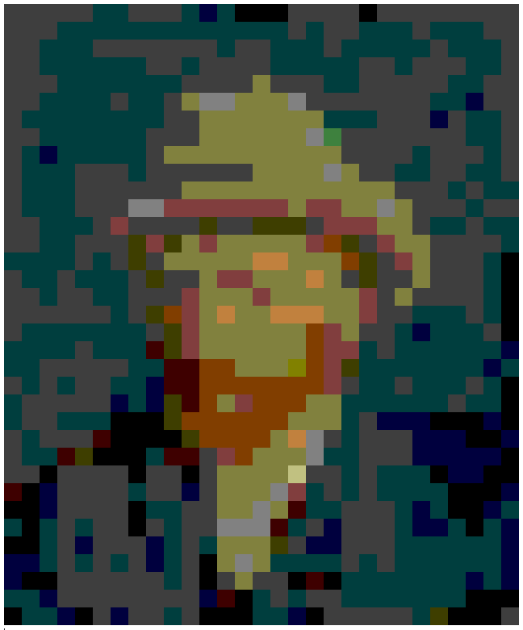

# slack-picture-converter

# Requires
- ImageMagick
- Rust

# Build
1. cd slack-picture-converter
2. pushd rsc && ./generator.sh
3. popd && cargo build --release

# How to use
1. Register rsc/\*.png to slack custom emoji.
2. Execute `./target/release/slack-picture-converter <path to image file> <tile size>`
3. Output copy and post to slack!

---

- Original Image.


- Converted Image.


- Slack message.
```
:p404040::p404040::p404040::p404040::p404040::p004040::p004040::p404040::p404040::p404040::p004040::p000040::p004040::p000000::p000000::p000000::p404040::p404040::p404040::p404040::p000000::p404040::p404040::p404040::p404040::p404040::p404040::p404040::p404040:

:p404040::p404040::p404040::p004040::p004040::p004040::p004040::p004040::p004040::p004040::p004040::p004040::p004040::p004040::p004040::p004040::p404040::p004040::p404040::p404040::p004040::p004040::p004040::p404040::p004040::p004040::p004040::p404040::p404040:

:p404040::p404040::p004040::p004040::p004040::p404040::p404040::p404040::p404040::p404040::p404040::p404040::p004040::p404040::p404040::p004040::p004040::p004040::p404040::p004040::p004040::p004040::p004040::p004040::p404040::p004040::p004040::p004040::p404040:

:p404040::p404040::p004040::p004040::p004040::p004040::p004040::p004040::p404040::p404040::p004040::p404040::p404040::p404040::p404040::p004040::p004040::p004040::p004040::p004040::p404040::p404040::p004040::p404040::p404040::p404040::p004040::p004040::p404040:

:p404040::p404040::p404040::p004040::p004040::p004040::p004040::p004040::p004040::p004040::p404040::p404040::p404040::p404040::p808040::p404040::p404040::p404040::p004040::p004040::p404040::p404040::p404040::p404040::p404040::p004040::p004040::p404040::p404040:

:p404040::p404040::p004040::p004040::p004040::p004040::p404040::p004040::p004040::p404040::p808040::p808080::p808080::p808040::p808040::p808040::p808080::p404040::p404040::p404040::p404040::p404040::p404040::p404040::p004040::p004040::p000040::p404040::p404040:

:p404040::p004040::p004040::p004040::p004040::p004040::p004040::p004040::p004040::p404040::p404040::p808040::p808040::p808040::p808040::p808040::p808040::p808040::p004040::p004040::p004040::p404040::p404040::p404040::p000040::p404040::p004040::p004040::p404040:

:p404040::p404040::p004040::p004040::p004040::p004040::p004040::p004040::p404040::p404040::p404040::p808040::p808040::p808040::p808040::p808040::p808040::p808080::p408040::p404040::p404040::p404040::p404040::p404040::p404040::p404040::p004040::p004040::p404040:

:p404040::p004040::p000040::p004040::p004040::p004040::p004040::p004040::p404040::p808040::p808040::p808040::p808040::p808040::p808040::p808040::p808040::p808040::p808040::p404040::p404040::p404040::p404040::p004040::p404040::p404040::p404040::p004040::p404040:

:p404040::p004040::p004040::p004040::p404040::p404040::p404040::p004040::p404040::p404040::p404040::p404040::p404040::p404040::p808040::p808040::p808040::p808040::p808080::p808040::p404040::p404040::p004040::p004040::p404040::p404040::p004040::p004040::p404040:

:p404040::p004040::p004040::p004040::p404040::p404040::p404040::p404040::p404040::p404040::p808040::p808040::p808040::p808040::p808040::p808040::p808040::p808040::p808040::p808040::p808040::p808040::p404040::p404040::p404040::p004040::p404040::p004040::p004040:

:p404040::p004040::p004040::p004040::p404040::p404040::p404040::p808080::p808080::p804040::p804040::p804040::p804040::p804040::p804040::p804040::p808040::p804040::p804040::p808040::p808040::p808080::p808040::p404040::p404040::p404040::p004040::p404040::p404040:

:p404040::p404040::p004040::p004040::p004040::p404040::p804040::p404040::p404040::p404040::p404040::p404000::p404040::p404040::p404000::p404000::p404000::p404040::p804040::p804040::p804040::p808040::p808040::p404040::p004040::p004040::p404040::p004040::p004040:

:p404040::p404040::p004040::p004040::p404040::p404040::p404040::p404000::p804040::p404000::p808040::p804040::p808040::p808040::p808040::p808040::p808040::p804040::p804000::p404000::p404040::p804040::p808040::p808040::p404040::p404040::p404040::p404040::p004040:

:p004040::p004040::p004040::p004040::p404040::p004040::p404040::p404000::p404040::p808040::p808040::p808040::p808040::p808040::pc08040::pc08040::p808040::p808040::p808040::p804000::p404000::p404040::p804040::p808040::p404040::p404040::p404040::p004040::p000000:

:p404040::p004040::p004040::p404040::p004040::p004040::p004040::p404040::p404000::p404040::p404040::p808040::p804040::p804040::p808040::p808040::p808040::pc08040::p808040::p404040::p404000::p404040::p404040::p808040::p404040::p404040::p404040::p004040::p000000:

:p404040::p404040::p004040::p404040::p404040::p004040::p004040::p404040::p404040::p404040::p804040::p808040::p808040::p808040::p804040::p808040::p808040::p808040::p808040::p808040::p804040::p404040::p808040::p404040::p404040::p404040::p404040::p004040::p000000:

:p404040::p404040::p404040::p404040::p404040::p404040::p004040::p404040::p404000::p804000::p804040::p808040::pc08040::p808040::p808040::pc08040::pc08040::pc08040::p808040::p808040::p804040::p404040::p404040::p004040::p004040::p004040::p404040::p004040::p000000:

:p404040::p004040::p004040::p004040::p004040::p004040::p004040::p004040::p404040::p404000::p804040::p808040::p808040::p808040::p808040::p808040::p808040::p804000::p804040::p808040::p404040::p404040::p004040::p000040::p004040::p004040::p004040::p404040::p000000:

:p004040::p004040::p004040::p004040::p404040::p004040::p004040::p004040::p400000::p404000::p804040::p808040::p808040::p808040::p808040::p808040::p808040::p804000::p804040::p804040::p004040::p404040::p004040::p004040::p004040::p004040::p004040::p004040::p000040:

:p004040::p004040::p404040::p404040::p404040::p404040::p404040::p004040::p004040::p400000::p400000::p804000::p804000::p808040::p808040::p808040::p808000::p804000::p804040::p404000::p004040::p004040::p004040::p004040::p004040::p004040::p004040::p000040::p004040:

:p404040::p004040::p404040::p004040::p404040::p404040::p004040::p004040::p000040::p400000::p400000::p804000::p804000::p804000::p804000::p804000::p804000::p804000::p804040::p404040::p004040::p004040::p404040::p004040::p004040::p004040::p404040::p004040::p000000:

:p004040::p404040::p404040::p404040::p404040::p404040::p000040::p004040::p000040::p404000::p400000::p804000::p808040::p804040::p804000::p804000::p804000::p808040::p808040::p004040::p004040::p004040::p004040::p004040::p004040::p404040::p004040::p004040::p000000:

:p004040::p404040::p404040::p004040::p004040::p004040::p000000::p000000::p000000::p404000::p804000::p804000::p804000::p804000::p804000::p804000::p808040::p808040::p808040::p004040::p404040::p000040::p000040::p000040::p000000::p000000::p000000::p000040::p000000:

:p404040::p004040::p404040::p404040::p404040::p400000::p000000::p000000::p000000::p000000::p404000::p804000::p804000::p804000::p804000::p808040::pc08040::p808080::p404040::p004040::p404040::p404040::p404040::p000040::p000040::p000040::p000000::p000000::p000040:

:p404040::p004040::p004040::p400000::p404000::p000000::p000000::p000000::p004040::p400000::p400000::p404040::p804040::p804000::p808040::p808040::p808040::p808080::p004040::p004040::p404040::p404040::p404040::p000040::p000040::p000040::p000040::p000040::p000000:

:p404040::p404040::p000000::p404040::p404040::p404040::p404040::p000000::p404040::p404040::p000000::p404040::p808040::p808040::p808040::p808040::pc0c080::p404040::p404040::p004040::p404040::p004040::p004040::p004040::p000000::p000040::p000040::p000000::p000000:

:p400000::p000000::p000040::p404040::p404040::p404040::p404040::p004040::p404040::p404040::p000040::p404040::p808040::p808040::p808040::p808080::p804040::p004040::p404040::p004040::p404040::p004040::p004040::p004040::p004040::p000000::p000000::p000000::p000040:

:p000000::p000000::p000040::p404040::p404040::p404040::p404040::p000000::p004040::p004040::p404040::p404040::p808040::p808040::p808080::p808040::p400000::p004040::p004040::p404040::p404040::p404040::p004040::p000040::p004040::p000000::p000000::p000040::p004040:

:p004040::p000000::p004040::p404040::p004040::p404040::p404040::p000000::p404040::p004040::p404040::p404040::p808080::p808080::p808080::p400000::p004040::p404040::p000040::p404040::p404040::p404040::p004040::p000040::p000040::p004040::p000000::p004040::p000040:

:p000000::p000000::p004040::p404040::p000040::p404040::p404040::p404040::p000040::p004040::p404040::p004040::p808040::p808040::p808040::p404000::p404040::p000040::p000040::p404040::p404040::p404040::p004040::p004040::p004040::p004040::p004040::p004040::p000040:

:p000040::p000040::p004040::p404040::p004040::p404040::p004040::p404040::p000040::p004040::p404040::p000000::p808040::p808080::p808040::p004040::p004040::p004040::p004040::p404040::p004040::p404040::p004040::p004040::p004040::p004040::p004040::p004040::p000040:

:p000040::p000000::p000000::p404040::p404040::p404040::p404040::p404040::p404040::p004040::p404040::p000000::p404040::p808040::p404040::p404040::p000000::p400000::p000000::p004040::p004040::p004040::p004040::p004040::p004040::p004040::p000040::p004040::p000040:

:p004040::p004040::p000040::p404040::p404040::p404040::p404040::p404040::p404040::p404040::p404040::p000040::p400000::p000000::p004040::p404040::p004040::p404040::p404040::p004040::p004040::p004040::p004040::p004040::p004040::p004040::p000000::p000000::p000000:

:p000000::p004040::p004040::p000040::p000000::p404040::p000040::p404040::p404040::p004040::p404040::p000000::p000000::p000000::p004040::p004040::p000040::p000000::p404040::p404040::p404040::p404040::p404040::p004040::p404000::p000000::p000000::p000000::p404040:
```
